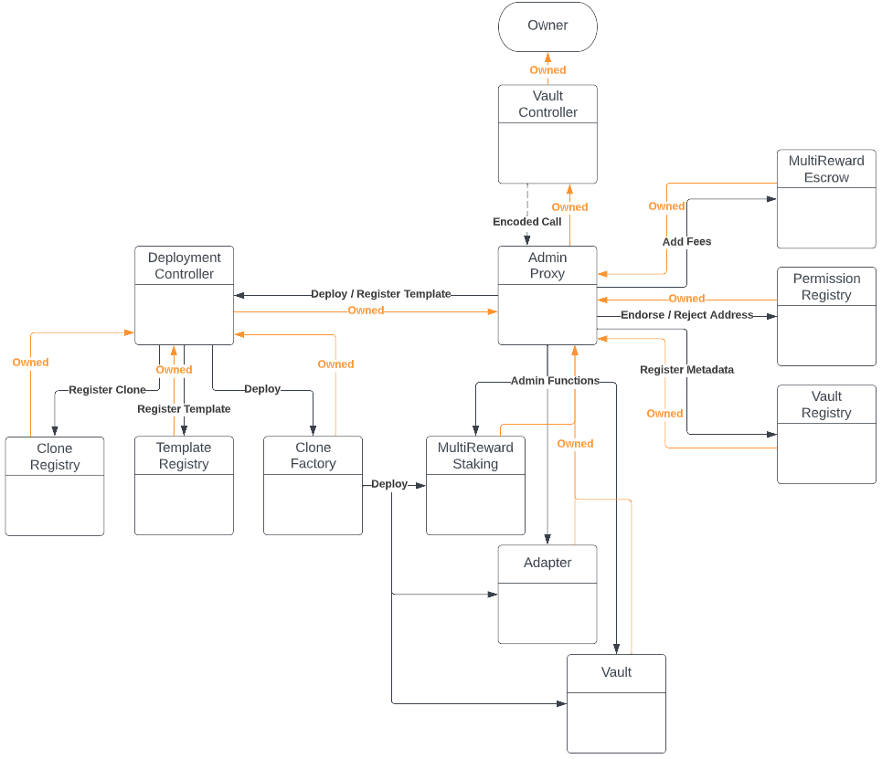

# PopcornDAO Vault Audit

This protocols goal is to make vault creation easy, safe and all without compromising on flexibility. It allows anyone to spin up their own Yearn in minutes. <br/>
**Vaults** can be created permissionlessly based on any underlying protocol and execute arbitrary strategies. 
The factory uses only endorsed **Adapters** and **Strategies** with minimal user input to reduce complexity for a creator and ensure safety of the created clones. It gives vault creators a quick and easy way to spin up any **Vault** they need and end users the guarantee that the created **Vault** will be safe.

The protocol consists of 2 parts. The Vault Factory and the actual Vaults and Adapters.
<br/>
<br/>
## Vault Factory
The Vault Factory part consists of a mix of Registry and Execution contracts. All contracts are immutable but execution contracts can be swapped out if requirements change or additional functionality should be added.

-   **CloneFactory:** A simple factory that clones and initializes new contracts based on a **Template**.
-   **CloneRegistry:** A minimal registry which saves the address of each newly created clone.
-   **TemplateRegistry:** A registry for **Templates**. Each Template contains an implementation and some metadata to ensure proper initialization of the clone. **Templates** need to be endorsed before they can be used to create new clones. Anyone can add a new **Template** but only the contract owner can endorse them if they are deemed correct and safe.
-   **DeploymentController:** This contract bundles **CloneFactory**, **CloneRegistry** and **TemplateRegistry** to simplify the creation of new clones and ensure their safety.
-   **EndorsementRegistry:** A simple registry to endorse or reject certain addresses from beeing used. Currently this is only used to reject potentially unsafe assets and in the creation of beefy adapters.
-   **VaulRegistry:** This registry safes new **Vaults** with additional metadata. The metadata can be used by any frontend and supply it with additional informations about the vault.
-   **VaultController:** This contract bundles all previously mentioned contracts. It adds additional ux and safety measures to the creation of **Vaults**, **Adapters** and **Staking** contracts. Any management function in the protocol must be executed via the **VaultController**.
-   **AdminProxy:** This contract owns any clone and most infrastructure contracts. Its used to make ownership transfers easy in case the **VaultController** should get updated. This contracts forwards almost all calls from the **VaultController**.

**Note:** This system ensures that minimal user input is needed and executions are handled with valid inputs and in the correct order. The goal is to minimize human error and the attack surface. A lot of configurations for **Adapters** and **Strategies** is very protocol specific. These are therefore mainly handled in the implementations itself. There is still a need for some kind of governance to ensure that only correct and safe **Templates** are added and dangerous assets get rejected. 


<br/>
<br/>
## Vault, Adapter & Strategy
-   **Vault:** A simple ERC-4626 implementation which allows the creator to add various types of fees and interact with other protocols via any ERC-4626 compliant **Adapter**. Fees and **Adapter** can be changed by the creator after a ragequit period.
-   **Adapter:** An immutable wrapper for existing contract to allow for ERC-4626 compatability. Optionally adapters can utilize a **Strategy** to perform various additional tasks besides simply depositing and withdrawing token from the wrapped protocol. PopcornDAO will collect management fees via these **Adapter**.
-   **Strategy:** An arbitrary module to perform various tasks from compouding, leverage or simply forwarding rewards. Strategies can be attached to an **Adapter** to give it additionaly utility.


<br/>
<br/>
## Utility Contracts
Additionally we included 2 utility contracts that are used alongside the vault system.
-   **MultiRewardStaking:** A simple ERC-4626 implementation of a staking contract. A user can provide an asset and receive rewards in multiple tokens. Adding these rewards is done by the contract owner. They can be either paid out over time or instantly. Rewards can optionally also be vested on claim.
-   **MultiRewardEscrow:** Allows anyone to lock up and vest arbitrary tokens over a given time. Will be used mainly in conjuction with **MultiRewardStaking**.
<br/>
<br/>
## Repository Overview
```
src
├── interfaces
├── utils
│   ├── MultiRewardEscrow.sol
│   ├── MultiRewardStaking.sol
├── vault
│   ├── adapter
│   │   ├── abstracts
│   │   │   ├── AdapterBase.sol
│   │   │   ├── OnlyStrategy.sol
│   │   │   ├── WithRewards.sol
│   │   ├── beefy
│   │   │   ├── BeefyAdapter.sol
│   │   ├── yearn
│   │   │   ├── YearnAdapter.sol
│   ├── strategy
│   ├── AdminProxy.sol
│   ├── CloneFactory.sol
│   ├── CloneRegistry.sol
│   ├── DeploymentController.sol
│   ├── EndorsementRegistry.sol
│   ├── TemplateRegistry.sol
│   ├── Vault.sol
│   ├── VaultController.sol
│   ├── VaultRegistry.sol
test
```

In scope for this audit are the following contracts:
- AdminProxy.sol
- CloneFactory.sol
- CloneRegistry.sol
- DeploymentController.sol
- EndorsementRegistry.sol
- TemplateRegistry.sol
- VaultController.sol
- VaultRegistry.sol
- Vault.sol
- AdapterBase.sol
- OnlyStrategy.sol
- WithRewards.sol
- BeefyAdapter.sol
- YearnAdapter.sol
- MultiRewardEscrow.sol
- MultiRewardStaking.sol

Some of these contracts depend on older utility contracts which is why this repo contains more than just these contracts. These dependencies have been audited previously.
Additionally there are some wip sample strategies which might help to illustrate how strategies can be used in conjuction with adapters.

**Note:** The `AdapterBase.sol` still has a TODO to use a deterministic address for `feeRecipient`. As we didnt deploy this proxy yet on our target chains it remains a placeholder value for the moment. Once the proxy exists we will simply switch out the palceholder address.
<br/>
<br/>
# Developer Notes

## Prerequisites

-   [Node.js](https://nodejs.org/en/) v16.16.0 (you may wish to use [nvm][1])
-   [yarn](https://yarnpkg.com/)
-   [foundry](https://github.com/foundry-rs/foundry)
<br/>
<br/>
## Installing Dependencies
```
foundryup

forge install

yarn install
```
<br/>
<br/>
## Testing

```
Add RPC urls to .env

forge build

forge test --no-match-contract 'Abstract'
```